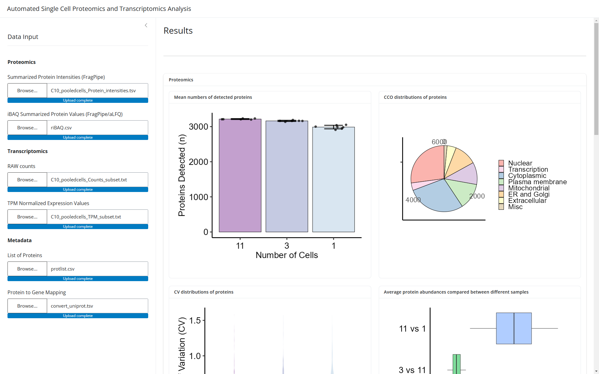
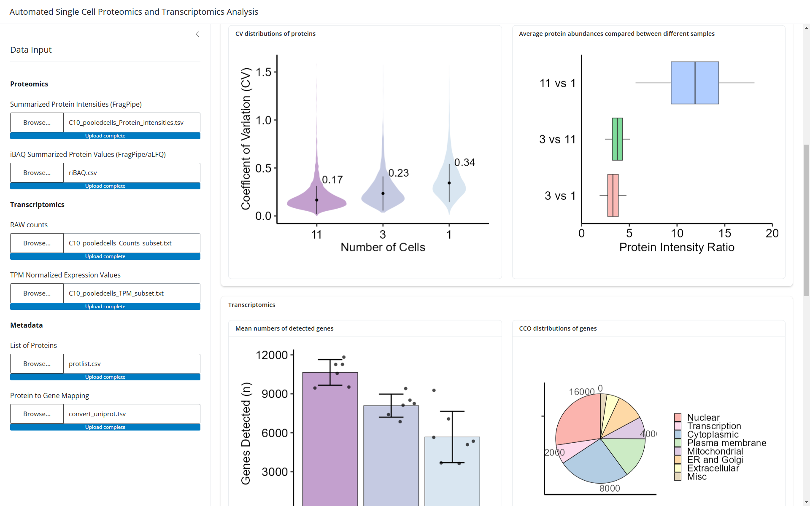
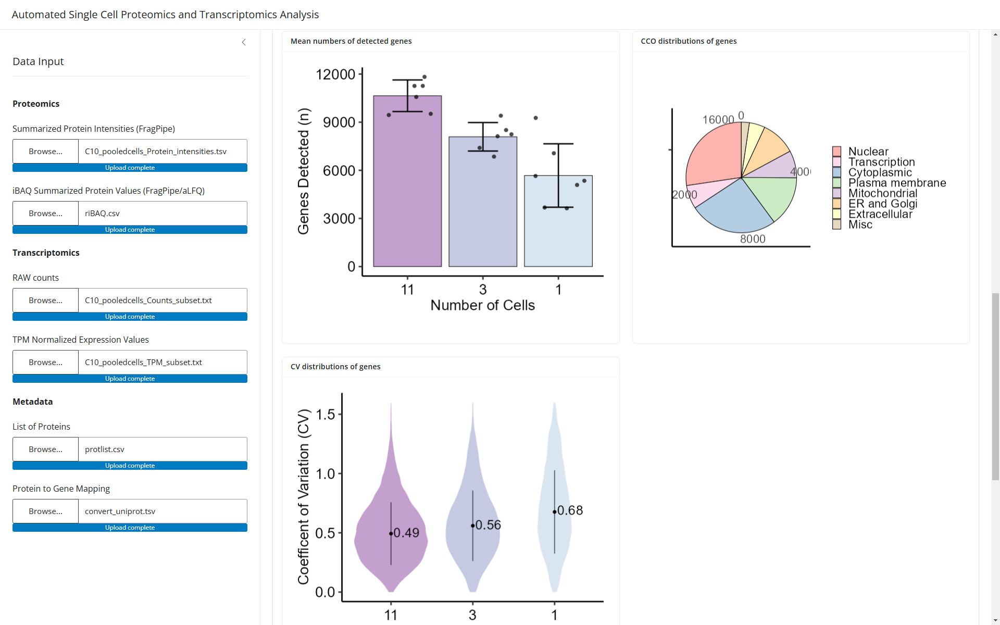
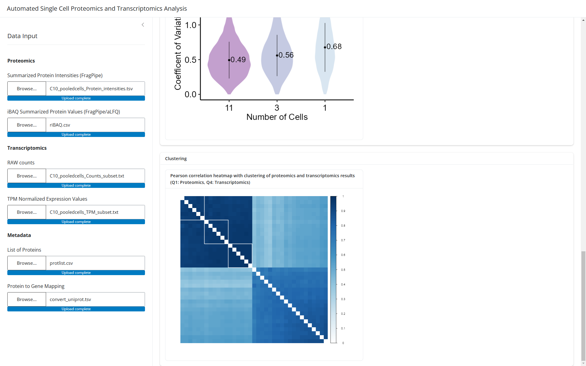

# SCOmics-Proof-of-Concept

A proof-of-concept implementation for automated analysis of (single cell) multi-omic proteomics
and transcriptomics data based on the publication by [Fulcher et al.](https://www.nature.com/articles/s41467-024-54099-z).

Implemented in [Shiny](https://shiny.posit.co/) using [R 4.4.2](https://www.r-project.org/).

Example data can be found here: [Cajun-data/nanoSPLITS](https://github.com/Cajun-data/nanoSPLITS/tree/main/Pooled_C10Cells)

## Screenshots

### Proteomics

- **Screenshot 1**
  
- **Screenshot 2**
  

### Transcriptomics

- **Screenshot 3**
  

### Clustering

- **Screenshot 4**
  

## Contact

- [micha.birklbauer@fh-hagenberg.at](mailto:micha.birklbauer@fh-hagenberg.at)
